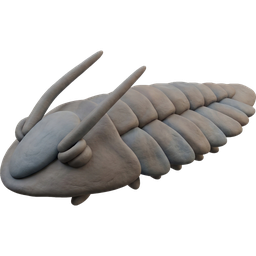

# Stonemite

<p align="center">
  
</p>

EverQuest multiboxing PiP overlay tool for Windows.

Stonemite puts picture-in-picture thumbnails of your other EQ windows on top of your active game window, with click-to-swap, drag-to-reorder, hover highlighting, and character name labels.

## Install

Download the latest release from [GitHub Releases](https://github.com/eqlaika/stonemite/releases):

- **Installer** (`stonemite-x.y.z-setup.exe`) — installs to Program Files, creates Start Menu shortcut, optional Windows startup
- **Portable** (`stonemite-x86_64-pc-windows-msvc.zip`) — extract and run anywhere

A system tray icon appears with access to all settings. Check for updates from the tray menu.

## Build from source

Requires Rust (MSVC toolchain) and [just](https://github.com/casey/just).

```
just build           # debug build
just build-release   # release build
```

Target: `x86_64-pc-windows-msvc`

## Release

```
just release 0.2.0
```

This bumps the version in `Cargo.toml`, builds a release binary, and packages it into `dist/stonemite-x86_64-pc-windows-msvc.zip`. Then:

1. Commit and tag: `git add -A && git commit -m "Release v0.2.0" && git tag v0.2.0`
2. Push: `git push && git push --tags`
3. Create a GitHub release for the tag and upload the zip

The app checks for updates against [eqlaika/stonemite](https://github.com/eqlaika/stonemite) GitHub releases via the `self_update` crate.

## Stonemite vs ISBoxer

[ISBoxer](https://isboxer.com/) has been the go-to multiboxing tool for years. It's powerful, but it comes with a subscription, a lengthy setup process, and a lot of complexity most players don't need. Stonemite is a focused alternative:

| | Stonemite | ISBoxer |
|---|---|---|
| **Price** | Free, open source | ~$50/year subscription |
| **Setup** | Run the installer, done | Inner Space install, wizard pages, character slots, window layout configs |
| **PiP overlays** | Native DWM thumbnails, click-to-swap, drag-to-reorder | Video FX regions routed through Inner Space |
| **Character labels** | Auto-detected | Manual per-character setup |
| **Input broadcasting** | Coming soon | Full key/mouse broadcasting and round-robin |
| **Window management** | Auto-detects EQ windows, z-order stacking | Window layouts with snapping and resizing |
| **Resource usage** | ~5 MB single exe | Inner Space + ISBoxer addon |
| **Updates** | One-click from system tray | Manual download through Inner Space |

**When to use Stonemite:** You want a PiP overlay that just works — no subscription, no 45-minute setup wizard. Launch it and go.

**When to use ISBoxer:** You need advanced input broadcasting features today, or you're already comfortable with the Inner Space ecosystem.

## Configuration

Config lives at `%APPDATA%\Stonemite\config.toml`. See [config/example.toml](config/example.toml) for options.

## Telemetry

Stonemite sends a single anonymous ping on each launch to help me understand if anyone is using the app. The payload contains only:

- A random anonymous ID (UUID, not tied to your identity)
- App version
- Windows version

No personal information, EQ character names, or config details are collected. Telemetry can be disabled by setting `telemetry = false` in `%APPDATA%\Stonemite\config.toml`, or by checking "Disable anonymous usage telemetry" during installation.

## Disclaimer

Stonemite uses standard Windows DWM thumbnail APIs to display copies of your game windows — the same mechanism Windows uses for taskbar previews and Alt-Tab. The optional character detection feature uses a lightweight DLL proxy to read log file names and identify which character is on each window.

Use Stonemite at your own risk. The author is not responsible for any account actions including suspensions, bans, or other consequences resulting from its use.

## License

[GPL v3](LICENSE) — free to use, modify, and distribute. Modified versions must remain open source. Copyright (c) 2026 Laikasoft.
