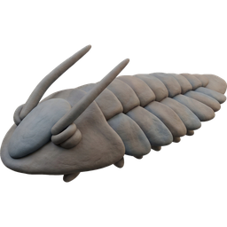

# Stonemite

<p align="center">
  
</p>

EverQuest multiboxing tool for Windows. Requires Windows 10 or later.

Stonemite makes multiboxing EQ easy: PiP overlays with click-to-swap, swap hotkeys, keyboard key broadcasting, hold-to-broadcast Mouse Clutch, character login, automatic character window labels, optional Stream Deck controls, drag-and-drop layout editor, and more. Stonemite is hi-DPI aware, works out of the box with no dependencies or configuration wizards, and is free and open source.

> [!WARNING]
> **Stonemite is not an automation tool.** Every gameplay input must originate from an immediate physical user action; Stonemite never decides when a gameplay action should occur. Input sequences, loops, and game-state reactions that control EQ are intentionally unsupported. Passive log observation can drive UI notifications and display-only timers, but those features cannot inject input or invoke gameplay controls. Pull requests that add unattended gameplay will not be accepted. Stonemite is designed to comply fully with EverQuest's Terms of Service and EULA.

## Install

Download the latest release from [GitHub Releases](https://github.com/eqlaika/stonemite/releases):

- **Installer** (`stonemite-x.y.z-setup.exe`) — installs to Program Files, creates a Start Menu shortcut, with optional Windows startup
- **Portable** (`stonemite-x86_64-pc-windows-msvc.zip`) — extract and run anywhere

A system tray icon appears with access to all settings. Check for updates from the tray menu.

## Stream Deck

The separately packaged **Stonemite · EQ boxing** plugin shows a live six-client roster and provides exact-client activation, broadcast control, window-number Swap, and configurable mapped Hotkey actions for all loaded, active, background, or selected boxes. Multi-step behavior stays in user-authored EverQuest socials. Same-PC installations connect automatically over loopback; running Stream Deck Desktop on another computer requires one-time LAN pairing.

The plugin requires Stream Deck Desktop 7.4+ on macOS 12+ or Windows 10+. It is not bundled with the Stonemite installer or portable ZIP. See [`streamdeck/README.md`](streamdeck/README.md) for setup, development, and packaging details.

## Build from source

Requires Rust (MSVC toolchain) and [just](https://github.com/casey/just).

```
just build           # debug build
just build-release   # release build
```

Target: `x86_64-pc-windows-msvc`

## Release

```
just release 0.5.0
```

This bumps the version in `Cargo.toml`, builds a release binary, and packages both `dist/stonemite-x86_64-pc-windows-msvc.zip` and `dist/stonemite-0.5.0-setup.exe`. Requires [Inno Setup 6](https://jrsoftware.org/isdl.php). Then:

1. Commit and tag: `git add -A && git commit -m "Release v0.5.0" && git tag v0.5.0`
2. Push: `git push && git push --tags`
3. Create a GitHub release: `gh release create v0.5.0 dist/stonemite-x86_64-pc-windows-msvc.zip dist/stonemite-0.5.0-setup.exe --title 'v0.5.0' --notes-file dist/release-notes.md`

The app checks for updates against [eqlaika/stonemite](https://github.com/eqlaika/stonemite) GitHub releases via the `self_update` crate.

## Stonemite vs ISBoxer

[ISBoxer](https://isboxer.com/) has been the go-to multiboxing tool for years. It's powerful, but it comes with a subscription, a lengthy setup process, and a lot of complexity most players don't need. Stonemite is a focused alternative:

| | Stonemite | ISBoxer |
|---|---|---|
| **Price** | Free, open source | ~$50/year subscription |
| **Setup** | Run the installer, done | Inner Space install, wizard pages, character slots, window layout configs |
| **PiP overlays** | Native DWM thumbnails, click-to-swap, drag-to-reorder | Video FX regions routed through Inner Space |
| **Character labels** | Auto-detected | Manual per-character setup |
| **Auto-login** | Encrypted credentials, automatic server select, one-click launch | Not available |
| **Input broadcasting** | Filtered key broadcasting plus hold-to-broadcast physical Mouse Clutch | Full key/mouse broadcasting and round-robin |
| **Window management** | Auto-detects EQ windows, z-order stacking | Window layouts with snapping and resizing |
| **Resource usage** | ~5 MB single exe | Inner Space + ISBoxer addon |
| **Updates** | One-click from system tray | Manual download through Inner Space |

Stonemite should replace ISBoxer for all but the most arcane usecases.

## Account login

Stonemite can launch your EQ accounts and log them in for you: no patcher, no typing passwords, no clicking through server select. Add your accounts and preferred server in settings, and Stonemite handles the rest.

### Password security

Your passwords are encrypted using [Windows DPAPI](https://learn.microsoft.com/en-us/windows/win32/api/dpapi/) and stored in your local config file. They are:

- **Encrypted by Windows itself** — Stonemite does not implement its own encryption or manage any keys. Only your Windows user account on your machine can decrypt them.
- **Never transmitted** — Stonemite never sends your passwords over the network.
- **Used only to launch EQ** — passwords are decrypted in memory only when launching the game client.

Stonemite is open source. The encryption code is in [`crates/stonemite/src/crypt.rs`](crates/stonemite/src/crypt.rs), so you can audit exactly what the app does with your data.

## Configuration

Config lives at `%APPDATA%\Stonemite\config.toml`. See [config/example.toml](config/example.toml) for options.

## Disclaimer

Stonemite uses standard Windows DWM thumbnail APIs to display copies of game windows. Its DLL proxy intercepts DirectInput only to discover EQ log paths and expose immediate, user-initiated keyboard or Mouse Clutch input to the selected EQ clients. It does not intercept rendering, read or modify game memory, or inspect network traffic. It may passively observe EQ logs for UI telemetry, notifications, and display-only timers, but it cannot turn those observations into gameplay input or otherwise automate gameplay.

Stonemite is intentionally designed to minimize account risk by avoiding automation and other invasive techniques. The risk of account action is believed to be low when the app is used as intended, but Daybreak has final authority over its rules and enforcement. As with any third-party tool, use Stonemite at your own discretion.

## License

Stonemite is licensed under the [GNU General Public License v3](LICENSE). The software free to use, modify, and distribute, but modified versions must remain open source. Copyright ©️ 2026 Laikasoft.
