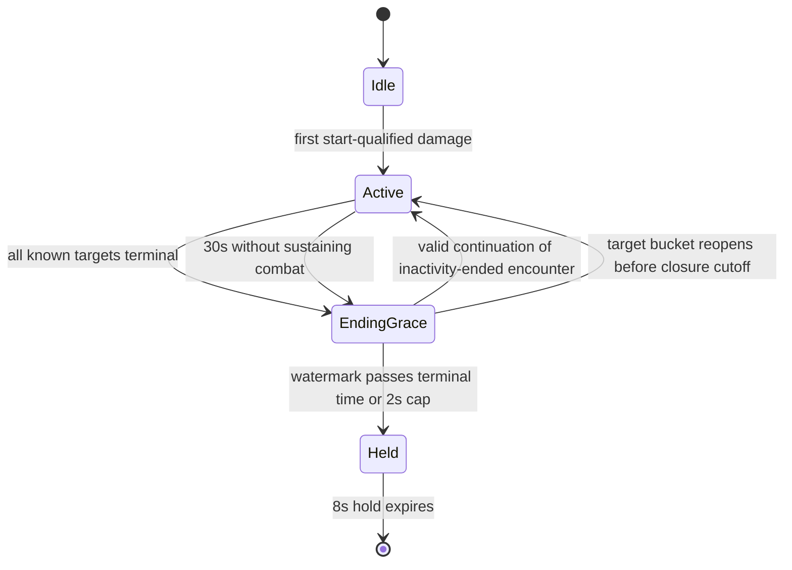

# DPS Overlay Design

## Status

- **Phase:** implementation-ready design
- **Last updated:** 2026-08-27
- **Product code implemented:** none
- **Behavioral reference:** EQLogParser `master` at revision
  [`2741f2557f2344263182a6d07fa744d8cd47df2d`](https://github.com/kauffman12/EQLogParser/tree/2741f2557f2344263182a6d07fa744d8cd47df2d)
- **Normative scope:** this document defines the Stonemite MVP. When examples,
  EQLP behavior, and this design disagree, this design wins.

## Summary

Stonemite will add a separate native, topmost, non-activating DPS panel for live
EverQuest group and raid damage. It will combine all observed encounter targets,
rank every observed participant, prefer each managed character's complete
personal log, and elect one best observer log for every other participant.
Damage from different logs is never added together for one participant.

The implementation is an event-sourced, platform-neutral combat engine feeding
immutable snapshots to the existing Win32 owner thread and DirectComposition
renderer. Source facts remain immutable so identity corrections, pet ownership,
encounter correlation, and source election can rebuild projections instead of
mutating accumulated totals.

The MVP shows:

- rank;
- participant name and attributable-pet marker;
- contribution bar;
- total Damage;
- active-time DPS;
- encounter-time DPS, labeled **SDPS**;
- the global top N plus every participating managed character omitted by that
  cutoff.

It deliberately excludes healing, tanking, encounter history, charts, exports,
ability breakdowns, and broad EQLogParser-style analytics.

## Product contract

### Job and audience

A multiboxer is actively playing EverQuest and needs a glanceable, trustworthy
reading of group or raid damage without configuring an external parser or
switching away from the game. The panel must remain passive, preserve EQ focus,
and make managed boxes visible even when raid leaders occupy the top ranks.

### Success

The feature succeeds when:

1. a qualifying fight appears automatically without manual encounter control;
2. every row can be explained by exactly one source log;
3. managed characters use their complete personal logs when available;
4. participants are not double-counted when the same hit appears in many logs;
5. pets are attributed without losing or duplicating owner damage;
6. the final result remains readable briefly and then gets out of the way;
7. ordinary users do not need to understand source election;
8. captured multi-log fixtures can deterministically reproduce every number.

### Non-goals

The MVP does not provide:

- healing or overhealing;
- damage taken, mitigation, or tanking statistics;
- encounter browsing or persistence across application restarts;
- charts, timelines, exports, reports, or web views;
- spell, skill, proc, or target breakdown UI;
- manual start, stop, reset, merge, or split controls;
- event-level cross-log damage merging or deduplication;
- game-memory access, network inspection, or automation;
- an API compatibility layer for EQLogParser.

The normalized event model may retain ability and modifier facts needed for
correct attribution or future diagnostics, but the MVP does not present them.

## Confirmed decisions and defaults

| Decision | MVP rule |
|---|---|
| Coverage | Group/raid-wide observed participants, not only managed boxes |
| Source policy | One source per participant per encounter |
| Managed source | Complete personal log wins; otherwise use best eligible observer |
| Cross-log damage | Never sum or splice losing candidates into the winner |
| Pets | Attribute inside each source candidate before election |
| Panel | Separate native DirectComposition surface, not PiP-label content |
| Interaction | Topmost, no-activate, click-through except in overlay edit mode |
| Rows | Global top 10 by default, plus participating managed boxes outside cutoff |
| Metrics | Damage, active-time DPS, and encounter-time DPS/SDPS |
| Start | Validated, positive, included player/owned-pet-to-NPC damage |
| End | All known targets terminal, or 30 seconds without sustaining combat |
| Ending grace | 2 seconds, driven by monotonic time and source watermarks |
| Final hold | 8 seconds; a new active encounter replaces a held result |
| Active range bridge | 6 EQ seconds between per-target ranges |
| Same-name NPCs | One canonical target bucket; do not invent instance identities |
| Combined title | Primary target plus additional distinct target names, for example `Terris Thule +3 mobs` |
| Lifecycle settings | Fixed in MVP; only enablement and top-row count are ordinary settings |
| Rendering | Publish at most 4 live updates per second, plus immediate lifecycle changes |

Defaults are product policy rather than protocol constants. They live together
in one versioned policy type and remain testable even though most are not exposed
in Settings initially.

## Architecture

```mermaid
flowchart LR
    A[Complete raw log records] --> B[eqlog parsers]
    B --> C[Immutable observations]
    A --> D[Source progress and watermarks]
    C --> E[eqcombat ledger]
    D --> E
    E --> F[Source-local encounter hypotheses]
    F --> G[Encounter correlation]
    G --> H[Participant-source candidates]
    H --> I[Whole-participant source election]
    I --> J[Encounter book snapshot]
    J --> K[Presented-encounter selection]
    K --> L[Win32 DPS controller]
    L --> M[Renderer-neutral DPS scene]
    M --> N[Direct2D / DirectComposition]
```



### Ownership boundaries

#### `crates/eqlog`

`eqlog` remains platform-neutral and owns only log interpretation:

- parsing EQ timestamps into a comparable second-resolution value while
  retaining the original text;
- parsing damage, combat attempts, slain messages, zone changes, and identity
  evidence;
- preserving observed names and explicit ownership hints;
- reporting parser failures without fabricating receipt-time combat events.

It does not own encounter lifecycle, multi-source correlation, source election,
rankings, timers, or HWND state.

#### `crates/eqcombat` — new workspace crate

A new platform-neutral crate owns combat-domain policy:

- the bounded immutable observation ledger;
- source presence intervals, generations, progress, and watermarks;
- temporal identity and pet-ownership evidence;
- source-local encounter hypotheses;
- correlated encounters and target buckets;
- lifecycle transitions;
- participant-source candidates;
- source election;
- timing and ranking;
- immutable encounter-book snapshots;
- deterministic replay and property tests.

It contains no Windows types, filesystem access, renderer code, global config
loading, or wall-clock calls. Callers supply monotonic instants to `apply` and
`tick`, allowing deterministic tests.

#### `crates/stonemite/src/log_watcher`

The existing log worker remains authoritative for complete-line framing and
source order. It will:

- propagate a source-scoped record identity from `LogTailer`;
- feed every complete record synchronously through `eqlog` and `eqcombat`;
- signal source registration, removal, and generation discontinuity;
- call the engine lifecycle tick during its existing bounded reconciliation
  cadence;
- publish DPS snapshots through a latest-value mailbox rather than a FIFO of
  every intermediate frame;
- post `WM_LOG_READY` when either ordinary log batches or a newer DPS snapshot
  are ready.

The optional bounded broadcast bus remains observational and must not become an
authoritative DPS input because lag there is explicitly lossy.

#### `crates/stonemite/src/overlay`

The Win32 owner thread owns physical presentation only:

- select the presented encounter using the active log source and the pure
  `eqcombat` selection policy;
- retain the latest immutable encounter-book snapshot;
- create, place, show, hide, and destroy the DPS HWND and composition surface;
- author a renderer-neutral `DpsScene`;
- integrate the panel with global visibility and overlay edit mode;
- request redraws when the selected scene key changes.

It must not parse damage, alter totals, remap pets, elect sources, or expire an
encounter.

#### `packages/desktop`

Settings will gain a dedicated **DPS overlay** page. Saving settings updates the
normal Stonemite configuration without requiring a restart.

## Source record and clock contract

### Record identity

`LogEnvelope.sequence` is currently one pipeline-global sequence. DPS also
requires a stable source-scoped identity:

```rust
pub struct SourceRecordId {
    pub source: LogSourceId,
    pub generation: u64,
    pub sequence: u64,
}
```

`LogTailer` already tracks a file generation but does not propagate it. Each
file state will additionally track a source-local sequence that resets to zero
whenever the generation increments. Every complete record receives exactly one
`SourceRecordId` before parsing.

The engine ignores a record ID it has already accepted. A generation change is
an explicit discontinuity, not permission to combine replayed history with the
old generation. Records from a new generation that predate the source's last
closed-through EQ second do not enter an active candidate; records in the last
open second require source-local content-and-occurrence deduplication before
acceptance.

Framing loss is also a source discontinuity even when no complete record can be
emitted. `LogTailer` must report a `SourceGap` when it discards an oversized
record, abandons bytes until a newline, or cannot preserve a complete boundary.
Reassociating a file with a different `LogSource` increments the generation and
either emits pending bytes under their original source or discards them with an
explicit `SourceGap`; it must never finish one record under a new identity.

### Clocks

The design deliberately uses two clocks:

- **EQ event time** calculates ordering, encounter ranges, DPS, and SDPS.
- **Monotonic receipt time** drives inactivity, ending grace, hold deadlines,
  snapshot throttling, and fail-safe lifecycle progress.

A parsed EQ timestamp is a local civil second from the log. All watched logs are
produced on the same Windows host, so no timezone conversion is needed for
within-session comparison. Calendar regressions, including DST or a manual
clock change, create a source discontinuity for encounter timing. They do not
silently generate negative durations.

A malformed or absent timestamped damage line is retained as a diagnostic fact
but does not contribute to DPS. Receipt time must never be substituted into an
EQ-time denominator.

### Source progress and common watermark

Every parseable raw log timestamp advances that source's observed watermark,
even if the line contains no combat event. Watermarks therefore describe log
progress, not participant activity.

Because EQ timestamps have one-second resolution, observing one record in
second `T` does not close `T`. Each source tracks both:

```text
observed watermark     = latest EQ second read
closed-through watermark = latest EQ second known complete
```

Normally a record in a later second closes every earlier observed second. The
latest second may also close after the tailer has remained at a stable EOF for
two monotonic seconds across at least two reconciliation passes. A later record
at or before a closed-through second is an out-of-order discontinuity: rebuild
the live projection, mark the source partial for completeness preference, and
do not mutate a held snapshot.

For one participant, first form the **coverage-qualified set** from candidate
sources that were present at the observed encounter start and have no framing,
generation, or calendar gap. This set does not depend on a watermark. For live
comparison, temporarily exclude a source as **lagging** when another qualified
source is at least two EQ seconds ahead and the trailing watermark has not
advanced for two monotonic seconds. A lagging source may rejoin after catching
up without a gap; a partial source cannot regain complete status during that
encounter.

```text
comparison watermark = minimum closed-through watermark of the
                       non-lagging coverage-qualified candidates
```

Candidate totals are projected inclusively only through that closed watermark.
If no qualified source remains, compare partial candidates at the minimum
closed-through watermark they share. This prevents ordinary watcher latency
from driving source switches while ensuring a permanently silent source cannot
block the meter. Personal-source authority is applied after coverage status is
known and before observer ranking.

## Normalized observation contract

The parser reports what the line says. Identity resolution remains a derived
combat-engine projection.

```rust
pub struct DamageObservation {
    pub attacker: ObservedCombatant,
    pub explicit_owner: Option<ObservedCombatant>,
    pub defender: ObservedCombatant,
    pub amount: u64,
    pub kind: DamageKind,
    pub ability: Option<Arc<str>>,
    pub outcome: DamageOutcome,
    pub modifiers: DamageModifiers,
}

pub struct ObservedCombatant {
    pub name: Arc<str>,
    pub perspective: Perspective, // named, you, your, yourself, etc.
}

pub enum DamageKind {
    Melee,
    DirectSpell,
    DamageOverTime,
    Proc,
    DamageShield,
    Bane,
    Pet,
    OtherIncluded,
}

pub enum CombatObservation {
    Damage(DamageObservation),
    Attempt(CombatAttempt),
    TargetSlain(TargetSlainObservation),
    PetOwnership(PetOwnershipObservation),
    PlayerEvidence(PlayerEvidence),
    ZoneChanged(ZoneObservation),
}
```

The exact Rust layout may vary during implementation, but it must preserve:

- actor, explicit owner when present, defender, amount, and damage kind;
- direct versus periodic/proc/shield origin where the line reveals it;
- hit versus miss/avoid/invulnerable outcome;
- source record identity and both clocks;
- enough observed text identity to re-resolve a provisional combatant;
- parser provenance and exclusion reason for diagnostics.

### Required parser coverage before production enablement

A versioned fixture manifest, `crates/eqlog/tests/fixtures/dps/manifest.toml`, is
the finite production gate. Every entry names its provenance—captured target
expansion/client build or the pinned EQLP behavioral reference—expected parser
output, and inclusion policy. MVP v1 must enumerate approved variants for:

- first-, second-, and third-person melee hits;
- melee misses, dodge, parry, block, riposte, invulnerability, and absorption;
- direct spell damage;
- damage-over-time ticks, including caster attribution variants;
- procs and weapon-spell damage;
- damage shields and reflected damage;
- bane or special damage retained by product policy;
- permanent pets, temporary pets, swarm pets, and explicit owner forms;
- slain messages, including pets and multi-word/apostrophe names;
- `You`/`Your` normalization per source;
- cross-server participant names;
- malformed, truncated, invalid UTF-8, and timestamp-free records;
- PvP, self-damage, falling/environmental damage, and NPC-versus-NPC rejection.

Production enablement requires every manifest entry to pass; it does not claim
exhaustive compatibility with every historical EQ line form. Unknown forms fail
closed with bounded diagnostics and become explicit follow-up manifest entries.
The parser must not guess an amount, actor, target, or event time.

## Event disposition policy

Starting, sustaining, contributing to, and closing an encounter are independent
properties.

| Observation | Starts | Sustains active encounter | Contributes damage | Closes target |
|---|---:|---:|---:|---:|
| Valid positive included participant/owned-pet → NPC damage | Yes | Yes | Yes | No |
| Valid zero-damage result | No | Yes, for a known target | No | No |
| Miss, dodge, parry, block, invulnerable, absorb | No | Yes, for a known target | No | No |
| NPC damage or attempt against a participant | No | Yes, for a known target | No | No |
| Taunt or similar combat intent | No | Yes, for a known target | No | No |
| Amount rejected by validation | No | Yes, for a known target | No | No |
| Slain observation | No | No | No | Yes |
| PvP, self-attack, unrelated NPC-versus-NPC, environmental | No | No | No | No |
| Unknown or unresolved actor/target | No while unresolved | No while unresolved | No while unresolved | No while unresolved |

Unresolved observations stay in the active ledger. Later identity evidence may
promote them and rebuild the projection. A promoted event may create or extend
an encounter using its original EQ timestamp, but UI snapshots remain subject
to current monotonic lifecycle state; finalized snapshots never mutate.

## Identity and pet ownership

### Participant identity

Canonical participant identity is exact and case-insensitive within a server:

```text
(server, canonical character name)
```

Cross-server names retain their server component. Prefix matching is forbidden.
`You`, `Your`, `Yourself`, and equivalent perspective forms normalize to the
`LogSource.character` for that source.

Managed identity is snapshotted from current log sources when an encounter
starts. A source added during the encounter may add a managed identity; source
removal does not make an already participating row unmanaged before completion.

### Entity classification

Player-like spelling alone is not sufficient to start an encounter. Evidence is
ordered and reversible:

1. a managed `LogSource.character`, exact `/who` result, group/raid roster fact,
   or explicit pet owner is verified player evidence;
2. a previously verified same-server character mapping is valid within its
   recorded interval;
3. a possible player name using a player-only combat form against a target
   already established by a verified participant is provisional player evidence;
4. the defender of a verified participant's NPC-target damage form is confident
   encounter-local NPC evidence unless stronger player/pet evidence conflicts;
5. a known generated-pet form or ownership line is pet evidence;
6. mercenaries are independent participant rows unless an explicit EQ form
   provides a stronger ownership relationship.

A start-qualified event requires a verified participant or owned pet attacking a
confident NPC. Once that anchor establishes the NPC target, earlier provisional
attacks against it may be promoted from the ledger. Conflicting evidence does
not destructively delete totals: the higher-confidence, temporally applicable
claim rebuilds the projection. This preserves EQLP's late player/pet correction
behavior without keying mutable fights by an identity guess.

### Temporal evidence

Identity and ownership are temporal claims, not permanent name maps:

```rust
pub struct PetOwnershipClaim {
    pub pet: CanonicalEntity,
    pub owner: ParticipantId,
    pub valid_from: EqSecond,
    pub valid_until: Option<EqSecond>,
    pub source: LogSourceId,
    pub evidence: OwnershipEvidence,
    pub confidence: Confidence,
}
```

Evidence precedence is:

1. explicit owner carried by the damage line;
2. direct summon/ownership statement;
3. persisted same-server mapping that is valid for the encounter interval;
4. heuristic classification, which may identify an entity as a pet but must not
   guess its owner.

Owner attribution happens independently inside every
`(encounter, participant, source)` candidate. Direct owner damage and pet damage
from that source are merged; an existing owner total is never overwritten.

A confidently identified pet with no owner remains a provisional pet row rather
than disappearing. It is labeled as a pet and can be reattributed before final
freeze. No ownership correction after `Held` begins mutates the frozen result.

## Source-local encounters and correlation

### Why two levels exist

One global accumulator would combine boxes fighting separately. Independent
source-local encounters preserve each log's evidence; correlation then joins
only hypotheses that describe the same combat.

### Source-local hypothesis

A source-local encounter begins on a start-qualified event and tracks:

- server and best-known zone;
- EQ start and latest sustaining time;
- monotonic start and latest receipt time;
- observed target names and terminal evidence;
- observed participant events;
- source generation and continuity;
- compact immutable ledger references.

### Correlation evidence

Two source-local hypotheses may join when they share the same server and have
compatible time ranges plus at least one strong signal:

1. a matching combat fingerprint such as EQ second, actor, target, amount,
   kind, and ability;
2. at least two independent shared participant/target observations in a known
   common zone;
3. explicit common group/raid membership plus target-name and time overlap;
4. an already correlated source observes a new target during its active
   encounter.

A matching target name is supporting evidence only and is never sufficient by
itself. Two boxes can fight different identically named trash at the same time,
even in the same zone. Matching fingerprints are correlation evidence only;
they never cause damage to be copied, summed, or deduplicated across source
candidates.

Same-server, same-zone, target-name, and time overlap without a strong signal are
insufficient to merge previously unrelated hypotheses. Unknown zone is allowed
when a matching fingerprint establishes the relationship.

Correlation is derived from the ledger and therefore rebuildable when identity
or zone evidence changes. Output does not depend on hash-map iteration or event
interleaving.

### Multiple correlated encounters

The engine may hold multiple active or held encounter clusters. The pure
presentation-selection policy chooses:

1. an active cluster containing the currently active EQ window's log source;
2. otherwise the active cluster containing the most managed sources;
3. otherwise the most recently sustaining active cluster;
4. otherwise the most recently finalized held cluster.

Stable encounter ID is the final tie-break. Switching the foreground box may
switch the displayed cluster without discarding either cluster's state.

## Target model, combining, and title

A target bucket is keyed by canonical case-insensitive NPC name within an
encounter. The first reliable spelling becomes its display name. Simultaneous
same-name NPCs remain one bucket because ordinary EQ logs do not provide a
reliable instance identity.

Cross-source death observations are coalesced as lifecycle evidence. This is
narrow control-event coalescing, not damage merging. Repeated death observations
from many logs do not create many mobs. A later valid hit against a terminal
same-name bucket reopens it during grace because another indistinguishable
instance may remain.

After participant source election:

1. sum elected participant damage per target;
2. choose the primary target by greatest elected damage;
3. break ties by earliest elected damage to the target;
4. break the final tie by canonical name;
5. title one target as `Terris Thule`;
6. title multiple distinct targets as `Terris Thule +3 mobs`.

The suffix counts additional distinct canonical target names, not claimed NPC
instances. The live title may change as a boss overtakes early trash. The title
freezes with the final snapshot.

## Encounter lifecycle

Lifecycle belongs to each correlated encounter, not to the panel window.



### `Idle`

No encounter exists and the normal panel is hidden. Edit mode may show a design
preview for placement.

### `Active`

The engine accepts facts, maintains candidates, and publishes live snapshots.
Inactivity is measured from the most recent sustaining observation using
monotonic receipt time.

### `EndingGrace`

On entry, freeze a **closure-source set** containing every source already
correlated with the encounter. A source discovered or first correlated later
cannot alter the closing encounter. This makes the closure boundary explicit
instead of dependent on a collection that can grow during grace.

The closure cutoff EQ second is:

- the latest slain second that made every known target terminal, for an
  all-targets-terminal ending;
- the latest accepted sustaining observation second, for an inactivity ending.

The encounter stops accepting unrelated later combat but remains open for facts
from closure sources at or before that cutoff and for identity resolution of
those facts.

For an all-targets-terminal ending:

- records from closure sources at or before the cutoff may belong to the old
  encounter;
- a later hit against a terminal target reopens it during grace;
- unrelated later combat starts a new source-local encounter.

For an inactivity ending, new sustaining combat from a closure source resumes
`Active`.

Finalization occurs when every closure source is closed through the cutoff or
the two-second monotonic cap expires. A closure source that has not advanced by
the cap becomes partial for final election. Facts for the old interval arriving
after the cap are diagnosed as `LateAfterClosure` and never mutate the held
snapshot; later start-qualified combat may form a new encounter. A kill line can
therefore be the final log record without blocking completion.

### `Held`

Rows, source elections, title, target count, durations, and totals are frozen for
eight seconds. A newly selected active encounter immediately replaces the held
panel. The immutable held snapshot itself never changes.

Ending grace, inactivity wait, and visual hold are excluded from DPS durations.

### Source discontinuity

File replacement, truncation, byte-boundary mismatch, oversized-record discard,
discard-until-newline framing loss, out-of-order closed-second data, calendar
regression, or source reassociation closes the source's continuity interval and
increments its generation. The new generation restarts its source-local sequence
at zero. Already accepted facts remain in their candidate and are never replayed.
That candidate becomes partial; other continuous sources may win. A reset does
not erase the correlated encounter when other sources continue.

## Participant candidates and source election

### Candidate boundary

The engine builds an independent candidate for every:

```text
(correlated encounter, participant, source)
```

The candidate contains direct and attributable-pet damage, damaging-event count,
per-target time ranges, target coverage, source coverage, and provenance.

Election is for the whole participant and whole encounter. It is never repeated
per target, spell, pet, damage kind, or time segment.

### Eligibility

A complete candidate's source:

- was present and advancing by the observed encounter start;
- has no framing, generation, calendar, or out-of-order discontinuity through
  the comparison watermark;
- is coverage-qualified and not currently lagging under the watermark policy;
- has a valid participant identity;
- delivered records exactly once.

Partial candidates remain available when no complete candidate exists, but their
quality is recorded.

### Election order

For a participating managed character:

1. an eligible complete personal source whose `LogSource.character` exactly
   matches the participant wins unconditionally, including attributable pet
   damage from that source;
2. if the personal source did not cover the encounter start or became
   discontinuous, apply the observer election to all available candidates,
   including the partial personal candidate.

For every other participant, select one candidate using this descending tuple:

```text
complete source coverage
valid included damage
valid damaging-event count
distinct canonical target count
active-time coverage
inverse lexical stable source ID
```

The last component means the lexically smallest stable source ID wins an exact
tie. Comparison occurs at the common source watermark while live and across the
complete encounter when finalizing.

Damage is the primary practical proxy for observer completeness. It is a product
policy, not a claim that incomparable log subsets have an objectively provable
winner. Internally record one of:

```text
AuthoritativePersonal
CompleteObserver
BestPartialObserver
IncompletePersonal
ProvisionalPet
```

The normal panel does not expose source IDs or quality labels. Diagnostics do.

### Source switching

Live election may switch when a candidate becomes strictly better at a newer
common watermark. The row moves as one complete candidate; no totals or ranges
carry over from its predecessor. Stable ties do not switch. Final election is
frozen.

## Timing and formulas

EQ timestamps have one-second resolution and ranges are inclusive. Damage and
all accumulated totals use checked `u128` arithmetic. An overflow is a diagnosed
engine failure for that encounter; values never wrap or saturate silently.

### Participant active time

For the elected source candidate of participant `p`:

1. create one range from first to last included damage for `p` on each canonical
   target;
2. include direct and attributable-pet events from the same source;
3. union overlapping ranges;
4. bridge the next range exactly when `next.begin - current.end <= 6 seconds`;
5. calculate each resulting segment as `end - begin + 1 second`.

A one-timestamp participant therefore has one active second. Pauses within the
same target's first-to-last range remain included. This deliberately preserves
EQLP's domain behavior for DoT casters, sparse attacks, mechanics, and temporary
invulnerability instead of deriving artificially small button-press segments.

```text
active_seconds(p) = union_duration(per_target_ranges(p), bridge = 6s)
DPS(p)            = elected_damage(p) / active_seconds(p)
```

### Encounter time and SDPS

Encounter time is a property of the correlated encounter, independent of which
participant source currently wins:

```text
encounter begin = earliest start-qualified outgoing damage in the cluster
encounter end   = latest accepted outgoing damage or later terminal death second
encounter time  = max(1s, end - begin + 1s)
SDPS(p)         = elected_damage(p) / encounter time
```

Ending grace, the 30-second inactivity wait, and the eight-second hold never
extend encounter time. Source election cannot change the shared denominator.

### Raid totals

Raid damage is computed only after election:

```text
raid damage = sum(elected participant damage)
```

No losing candidate contributes. If raid aggregate metrics are later displayed:

```text
raid active DPS = raid damage / union(all elected participant active ranges)
raid SDPS       = raid damage / encounter time
```

## Ranking and row projection

1. Include candidates with positive elected damage.
2. Sort by damage descending.
3. Break ties by active DPS descending, then canonical participant identity.
4. Assign deterministic ordinal global ranks; tied damage does not share a rank.
5. Take the configured top N.
6. Append every participating managed character omitted by the cutoff, in global
   rank order, after a visual separator.
7. Preserve each appended managed character's true global rank.

Managed rows can make the visible row count exceed N. A managed character with no
positive elected damage is not a participant and is not appended.

Pet damage remains bundled with its owner. A participant with attributable pet
damage receives a compact `+Pets` marker. A provisional unknown-owner pet uses
its own explicitly marked pet row until resolution.

DPS and SDPS are integer display values calculated without floating point using
overflow-safe round-half-up arithmetic:

```text
q = damage / seconds
r = damage % seconds
rounded_rate = checked_add(q, (2 * r >= seconds) ? 1 : 0)
```

Damage and rates use `u128`; `seconds` is a positive `u64` promoted before the
calculation. Contribution is an integer millionth ratio in `[0, 1_000_000]`,
calculated by an overflow-safe `mul_div_u128` helper, and converts to floating
point only inside the renderer. Large values use locale-independent ASCII
grouping, for example `1,234,567`.

## Immutable snapshot contract

The platform-neutral output is an `Arc<EncounterBookSnapshot>` containing all
active and held correlated encounters needed for deterministic presentation
selection.

A presented encounter snapshot includes at least:

```rust
pub struct EncounterSnapshot {
    pub id: EncounterId,
    pub revision: u64,
    pub phase: EncounterPhase,
    pub end_reason: Option<EndReason>,
    pub title: Arc<str>,
    pub primary_target: CanonicalTargetId,
    pub additional_target_names: usize,
    pub encounter_seconds: u64,
    pub raid_damage: u128,
    pub rows: Arc<[DpsRowSnapshot]>,
    pub source_members: Arc<[LogSourceId]>,
    pub last_sustained_at: EqSecond,
    pub held_until: Option<MonotonicDeadline>,
}

pub struct DpsRowSnapshot {
    pub rank: usize,
    pub participant: ParticipantId,
    pub display_name: Arc<str>,
    pub managed: bool,
    pub has_pet_damage: bool,
    pub provisional_pet: bool,
    pub damage: u128,
    pub active_seconds: u64,
    pub dps: u128,
    pub sdps: u128,
    pub contribution_millionths: u32,
    pub source_quality: SourceQuality,
}
```

Renderer-facing snapshots may omit diagnostics, but the engine retains a bounded
explanation record for every row:

- elected source and election tuple;
- losing candidate totals and coverage;
- direct and pet damage;
- active ranges;
- source switches;
- excluded and unresolved event counts.

A snapshot revision changes only when its semantic contents change. Finalized
snapshots are immutable.

## Snapshot publication and threading

The log worker applies observations synchronously to `eqcombat`; this is part of
the authoritative reducer path, alongside existing telemetry and triggers.

Publication rules:

- publish the first active snapshot immediately;
- coalesce ordinary live changes to at most one snapshot every 250 ms;
- publish `EndingGrace`, `Held`, selection-affecting source removal, and removal
  from the encounter book immediately;
- use a latest-value mailbox so the owner thread cannot accumulate stale frames;
- keep log-event FIFO delivery and DPS-snapshot delivery logically separate;
- if publication fails, log a diagnostic and hide rather than silently presenting
  an indefinitely stale current result.

The worker's existing 500 ms reconciliation wake is sufficient to service the
30-second inactivity and eight-second hold deadlines. Ending grace should use a
dedicated nearest-deadline wake or a shorter bounded tick so its two-second cap
is not delayed by more than one scheduler interval.

The owner thread takes the latest snapshot during `drain_log_events`, computes
the selected encounter using the current active source, updates a scene key, and
requests one redraw when it changes.

## Native panel design

### Window behavior

The DPS panel is one dedicated popup HWND and one DirectComposition surface. It
uses the existing hardware compositor and device-recovery transaction model.

Normal mode:

- topmost tool window;
- no activation;
- excluded from Alt-Tab;
- click-through hit testing;
- transparent outside authored content;
- visible only when enabled, an encounter is selected, the global overlay is not
  hidden, at least one managed EQ client exists, and EQ or a Stonemite-owned
  surface owns foreground;
- independent of the existing `has_pip` visibility prerequisite, so one active
  EQ client can still show raid DPS without a background PiP;
- never steals mouse capture or keyboard focus.

Edit mode:

- the panel remains no-activate but stops being click-through;
- it shows a yellow edit frame consistent with existing PiP edit mode;
- it renders representative preview rows when no encounter is active;
- it can be dragged and horizontally resized within the active monitor work area;
- leaving edit mode saves placement and width after clamping to the work area.

The panel's content-derived height follows the displayed row count. Top N is the
ordinary control over height; managed extras may extend it. The MVP-supported
bound is top 15 plus Stonemite's current maximum of six managed EQ clients—one
active and five background PiPs—on a work area of at least 640 × 540 logical
pixels. Every promised row must fit at the minimum row height within that bound;
normal presentation never silently elides a configured top-N row or a
participating managed row. Smaller work areas are diagnosed as unsupported and
may require the user to choose a smaller top-N setting.

### Placement

First-run placement is near the upper-left of the active EQ monitor's work area,
24 device-independent pixels (DIPs) from each edge. Saved placement is:

```rust
pub struct DpsOverlayPlacement {
    pub x_dip: i32,     // offset from work-area left
    pub y_dip: i32,     // offset from work-area top
    pub width_dip: u32,
}
```

On save, convert the physical HWND rectangle using the active monitor's DPI and
store DIPs. On restore, apply those offsets to the monitor containing the active
EQ window, convert to physical pixels using that monitor's current DPI, and clamp
the complete panel to its physical work area. DPI/work-area changes may clamp
the runtime rectangle without rewriting the saved preference; leaving edit mode
commits the new clamped DIPs.

One global placement follows the active EQ monitor. A future version may add
per-monitor placement; MVP does not.

### Visual hierarchy

The panel is a restrained, dense native meter aligned with Stonemite's existing
Segoe UI and Direct2D visual language. MVP surface fill uses fixed alpha 232 of
255 with fully opaque primary text; contribution bars remain subordinate to the
text contrast floor:

1. header: combined target title on the left, encounter duration on the right;
2. compact column labels: `#`, `Player`, `Damage`, `DPS`, `SDPS`;
3. ranked rows with a low-contrast contribution bar behind the row;
4. a separator before managed rows appended outside the cutoff.

The title and participant name receive space before numeric columns. Names
truncate with an ellipsis; numeric columns remain tabular and right-aligned.
Damage bars encode proportion but text remains authoritative, so color is never
the only carrier of rank or value.

Recommended logical dimensions:

- default width: 440 px;
- minimum width: 360 px;
- header: 38 px;
- column header: 22 px;
- row: 27 px, minimum 21 px;
- outer radius and spacing consistent with existing notification surfaces.

Contribution renders `contribution_millionths / 1_000_000`, clamped to
`[0, 1]`. Managed extra rows use the same scale and true rank rather than a
separate visual scale.
The active managed box may receive a restrained identity accent, but no row uses
animation to imply changing damage.

### Motion and accessibility

Normal live updates replace numbers and bar widths without spring, count-up,
rank-shuffle, or final-fade animation. The panel hides immediately at the hold
deadline.

The Settings page uses normal labeled controls, descriptions, keyboard focus,
and validation. The in-game panel is a passive visual supplement and remains
non-focusable. MVP panel opacity is a fixed renderer policy tested for readable
contrast over EQ; opacity customization is deferred.

### Empty and failure states

- No selected encounter: hide the normal panel.
- Edit mode without an encounter: show clearly synthetic preview rows.
- Parser gap: continue with known valid events and emit bounded diagnostics.
- Engine failure: remove the panel rather than leaving an unmarked stale result.
- Composition device loss: keep the HWND hidden until one complete recovered
  scene is committed, following existing compositor behavior.

## Configuration and Settings

### Config fields

The MVP adds top-level configuration equivalent to:

```rust
pub dps_overlay_enabled: bool,                 // default true in product builds
pub dps_overlay_top_rows: u8,                  // default 10; allowed 5, 10, 15
pub dps_overlay_placement: Option<DpsOverlayPlacement>,
```

A development-only feature gate may keep the panel disabled until the parser
coverage gate passes. Released behavior defaults to enabled to preserve
Stonemite's low-setup product promise.

The MVP does not expose inactivity, grace, active-range bridge, hold duration,
source-election order, or correlation thresholds. These remain centralized
policy defaults rather than scattered literals.

### Settings page

Add **DPS overlay** to `packages/desktop/src/App.tsx` near **PiP overlay**.
The page contains:

- **Live meter**
  - `Show DPS overlay` toggle;
  - explanation that it appears automatically during combat and remains
    click-through outside edit mode.
- **Rows**
  - `Top participants` select with 5, 10, and 15;
  - explanation that participating managed boxes are always appended when below
    the cutoff.
- **Placement**
  - concise instruction to use the existing overlay edit mode for movement and
    width;
  - a required `Reset placement` action that invokes a dedicated Tauri command
    and stores `None`, never a sentinel coordinate.

No source-election controls appear in the ordinary UI. They would expose
implementation detail without giving users enough evidence to choose correctly.

Placement is controller-owned state and is intentionally absent from
`SettingsDraft`. Ordinary settings save starts from the latest `Config` and
preserves placement. `reset_dps_overlay_placement` updates only that field, then
posts an owner-thread config-change message. Saving enabled/top-row settings also
posts that message; the owner thread applies validated DPS settings and redraws
or hides the panel without restart.

## Diagnostics

Diagnostics must answer “why this number?” without burdening the meter.

For each active/final encounter, retain bounded structured diagnostics for:

- source hypotheses and correlation evidence;
- source coverage intervals, generations, and watermarks;
- target canonicalization and terminal observations;
- participant identity evidence;
- pet ownership claims and reattribution;
- every source candidate and election tuple;
- source switches;
- excluded damage by reason and amount;
- unresolved observations;
- lifecycle transitions and end reason;
- snapshot publication and renderer failures.

Default logs summarize transitions and anomalies rather than every hit. A debug
capture mode may serialize normalized observations and decisions for fixture
creation, but raw chat and credentials remain outside DPS capture.

## Invariants

The following are architectural requirements, not best-effort behaviors:

1. Every displayed participant row names exactly one elected source.
2. Direct and pet damage in one row come from that same source.
3. Raid damage equals the sum of every elected participant candidate, including
   elected participants outside the displayed top N, plus explicitly represented
   provisional pet candidates; losing sources contribute zero.
4. No damage event is deduplicated or summed across logs to construct a row.
5. One source record ID contributes at most once.
6. Given identical source-local order, record IDs, EQ times, and monotonic
   receipt times, interleaving of records accepted before the frozen closure
   boundary and map iteration order cannot change a finalized snapshot.
7. A complete managed personal source defeats every observer for that character.
8. A partial personal source is not falsely treated as complete.
9. Late pet ownership merges rather than overwrites source-local owner totals.
10. A participant's source is elected for the whole encounter, never per target,
    pet, ability, damage kind, or range.
11. Encounter time is independent of participant source election.
12. UI visibility, edit mode, and renderer recovery cannot alter combat state.
13. A final kill line completes through monotonic time without another log line.
14. Ending grace, inactivity wait, and visual hold never enter DPS denominators.
15. Managed participants outside top N retain their true global rank.
16. Finalized snapshots never mutate.
17. Control-event coalescing cannot change source-local damage totals.
18. Unsupported or malformed damage is diagnosed, never silently guessed.
19. The closure-source set and cutoff second never grow after entry to
    `EndingGrace`.
20. No configured top-N row or participating managed row is silently elided
    within the supported work-area and client bound.

## Required fixture matrix

Fixtures are multi-file transcripts with a manifest describing sources,
characters, servers, generations, receipt ordering, expected decisions, and
expected final snapshots.

| Fixture | Expected proof |
|---|---|
| One hit observed by four logs | Four candidates; exactly one elected contribution |
| Complete managed personal log versus larger observer | Personal source wins |
| Managed personal log starts late | Best complete observer wins; personal marked partial |
| Non-box observer disagreement | Deterministic total-first whole-source election |
| Observer delivery lag | Common closed-through watermark prevents source thrash |
| Partial delivery within one EQ second | Open second is not compared as complete |
| Permanently silent candidate source | Exact lag rule prevents indefinite blocking |
| Exact candidate tie | Stable lexical source tie-break |
| Candidate leader changes | Entire row switches; no carry-over |
| Direct plus pet damage | Both merge inside one source candidate |
| Late pet mapping | Owner increases by merge; pet row disappears; no overwrite |
| Unknown pet | Explicit provisional pet behavior |
| Same pet name in later interval | Temporal ownership prevents cross-encounter leakage |
| Multiple simultaneous targets | One encounter and deterministic primary title |
| Same-name simultaneous adds | One target name bucket; no invented instance count |
| Separate same-name trash fights in one zone | Target-name overlap alone does not correlate |
| Same-name damage after death | Bucket reopens during grace |
| Kill is final line | Held snapshot appears without another record |
| Trailing same-second damage | Included before final freeze |
| Source first correlates after grace starts | Frozen closure-source set excludes it from old result |
| Record arrives after the two-second cap | `LateAfterClosure`; held snapshot remains immutable |
| Boss invulnerability over positive-hit gap | Sustaining attempts prevent premature timeout |
| Thirty seconds of true silence | Inactivity finalizes without extending encounter time |
| New fight during held result | New active encounter replaces held display |
| Two boxes in different fights | Separate clusters; active EQ source selects panel |
| Boss plus add sources initially disjoint | Later correlation joins without summing duplicates |
| Source truncation/recreation | Old facts retained, replay prevented, source becomes partial |
| Oversized line/framing discard | Explicit `SourceGap`; source becomes partial |
| Source reassociation with pending bytes | Old identity retained or explicit gap; never new identity |
| Source removed mid-fight | Other sources continue; no encounter erasure |
| EQ clock regression | Source discontinuity; no negative duration |
| Malformed timestamped damage | Diagnostic and no receipt-time substitution |
| PvP and self damage | No start, sustain, or contribution |
| Rejected amount during active fight | Sustains known encounter but contributes zero |
| Participant pauses on one target | First-to-last target range includes pause |
| Next target range begins 6s after prior end | Active ranges bridge |
| Next target range begins 7s after prior end | Active ranges remain separate |
| One timestamp participant | One active second |
| Top N plus omitted boxes | Global ranks preserved and boxes appended |
| 640×540 DIP work area, top 15, six boxes | Every promised row remains visible |
| Verified box anchors an initially unknown target | Target becomes encounter-local NPC; earlier provisional hits promote |
| Identity case and prefixes | Exact case-insensitive match; no prefix collision |
| Reordered source ingestion with fixed receipt metadata | Identical finalized snapshot |
| Half-up rate boundary | Exact integer DPS/SDPS rounding |
| Maximum accumulated damage | Checked `u128`; no wrap or float drift |
| Duplicate source delivery | Source record ID prevents double count |
| Renderer hidden/edit transitions | Engine snapshot unchanged |

Property tests should generate source interleavings, duplicate observations,
candidate ties, and late identity evidence while checking every invariant.

## Expected integration map

| Concern | Existing integration points | Expected change |
|---|---|---|
| Event contract | `crates/eqlog/src/event.rs`, `raw.rs` | Add normalized damage/control observations and parsed EQ time while preserving observed facts |
| Parser registration | `crates/eqlog/src/parsers/mod.rs`, `parsers/combat.rs` | Replace coarse local combat signals only where richer events remain compatible; add versioned fixtures |
| File provenance | `crates/stonemite/src/log_watcher/tailer.rs` | Propagate generation, source-local sequence, stable-EOF progress, and explicit framing gaps |
| Authoritative reduction | `crates/stonemite/src/log_watcher/pipeline.rs`, `log_watcher/mod.rs` | Own `eqcombat`, lifecycle ticking, and latest-value snapshot publication |
| Owner-thread drain | `crates/stonemite/src/overlay/event_loop.rs` | Take the newest encounter-book snapshot and update presentation selection |
| Domain/presentation state | `crates/stonemite/src/overlay/state.rs`, `presentation.rs` | Add the DPS controller, selected scene key, HWND, and surface ownership |
| HWND lifecycle | `crates/stonemite/src/overlay/lifecycle.rs`, `window_procs.rs`, `surfaces.rs` | Register, render, recover, show, hide, and destroy the no-activate panel |
| Scene/rendering | `crates/stonemite/src/overlay/scenes.rs`, `render/compositor.rs`, `render/scene_d2d.rs` | Add renderer-neutral DPS layout and one concrete Direct2D role renderer |
| Edit mode | `crates/stonemite/src/overlay/edit_mode.rs`, `interaction.rs` | Add panel drag/width state and DIP placement persistence |
| Visibility | `crates/stonemite/src/overlay/surfaces.rs` | Share user/foreground permission while avoiding the PiP-only `has_pip` prerequisite |
| Persistent config | `crates/stonemite/src/config.rs` | Add serde-defaulted DPS policy and placement fields |
| Settings bridge | `crates/stonemite/src/settings_model.rs`, `settings_dialog.rs` | Add enabled/top-row fields, placement-reset command, validation, and live owner notification |
| Settings UI | `packages/desktop/src/App.tsx`, `settings/types.ts`, `settings/mock.ts`, new `pages/DpsPage.tsx` | Add navigation, controls, mock values, and component tests |

## Implementation plan

### Phase 0 — fixtures and contracts

1. Add the versioned MVP v1 fixture manifest and its privacy-reviewed records.
2. Define parsed EQ time, record provenance, observed combatants, damage kinds,
   outcomes, and slain observations in `eqlog`.
3. Write parser tests before broadening `CombatEvent`.
4. Establish validation policy and bounded parser diagnostics.

**Gate:** every enumerated MVP v1 manifest entry has exact parser output and
policy expectations. Unknown forms fail closed and are tracked without making
the finite v1 gate unachievable.

### Phase 1 — platform-neutral combat engine

1. Add `crates/eqcombat` to the workspace.
2. Implement immutable ledger records and exactly-once source identities.
3. Implement source presence, generations, and watermarks.
4. Implement temporal identity and pet claims.
5. Implement source-local encounter hypotheses and lifecycle.
6. Implement correlation and target projection.
7. Implement participant candidates, election, timing, ranking, and snapshots.
8. Add deterministic replay, invariant, and property tests.

**Gate:** all synthetic and captured multi-log fixtures produce the expected
final snapshot for every tested interleaving that preserves source-local order,
record identity, EQ time, and supplied monotonic receipt metadata.

### Phase 2 — authoritative ingestion integration

1. Propagate file generation and source-local sequence from `LogTailer`, and emit
   explicit framing-gap/reassociation discontinuities.
2. Feed observations synchronously into `eqcombat` from the log worker.
3. Signal source additions, removals, resets, and time regressions.
4. Add lifecycle ticking and the latest-value snapshot mailbox.
5. Wake the owner thread for snapshot changes without flooding FIFO batches.
6. Add transition-level diagnostics.

**Gate:** a headless Windows run can replay live-tailed multi-log fixtures and
publish the same snapshots as direct engine replay.

### Phase 3 — owner-thread and native presentation

1. Add a `DpsOverlayController` to `OverlayState`.
2. Add the DPS HWND and authored scene state to `PresentationState`.
3. Register a dedicated no-activate popup class and window procedure.
4. Add renderer-neutral `DpsScene` and physical-pixel layout tests.
5. Add Direct2D drawing and compositor role methods.
6. Integrate device recovery, redraw coalescing, global visibility, active-source
   selection, DPI changes, and monitor changes.
7. Integrate edit-mode preview, movement, width adjustment, and persistence.

**Gate:** the panel never activates EQ, remains click-through normally, recovers
from device loss with a complete frame, and displays top 15 plus six managed
participants on a 640 × 540 DIP work area at supported DPI scales.

### Phase 4 — configuration and Settings

1. Add serde-defaulted config fields and validation.
2. Extend Rust `SettingsDraft`, payload conversion, and save behavior.
3. Extend TypeScript settings types and browser mock data.
4. Add the DPS navigation item and settings page.
5. Add component tests for enablement, top-row options, and the dedicated
   placement-reset command.
6. Add an owner-thread config-change message and apply validated DPS settings
   live without restart while preserving controller-owned placement on ordinary
   settings saves.

**Gate:** old configurations migrate through defaults; invalid values are
rejected consistently by Rust and constrained by the UI; save and placement
reset both update the running panel without restart or stale-position overwrite.

### Phase 5 — Windows validation

Run Windows-specific builds and tests on the configured host from `.envrc`:

- `just build`;
- `just desktop-test`;
- focused Rust unit and replay tests;
- captured live group and raid sessions with multiple personal logs;
- click-through, foreground, edit mode, DPI, monitor, device-loss, global-hide,
  and source-reset checks.

Do not use `just deploy-dev` unless an actual development deployment is requested.

**Gate:** diagnostics explain every deliberate source election in the validation
captures, and displayed totals match hand-verified fixture expectations.

## Knowledge traceability

The purpose of this table is to retain EQLP's accumulated real-world behavior
while separating it from defects and single-log implementation accidents.

| Rule | Verified EQLP behavior | Stonemite decision | Reason | Required evidence |
|---|---|---|---|---|
| Start gate | Overlay fight appears after outgoing `DamageHits` | Require validated positive included outgoing damage | Rejected or zero damage must not create a false meter | Gate fixtures |
| Taunt | Can create a temporary `Fight` but not an overlay fight | Does not start; sustains a known encounter | Preserve useful liveness without false starts | Disposition tests |
| Misses/avoidance | Parsed but do not add hit damage | Do not start or contribute; sustain a known target | Preserve invulnerability/mechanic phases | Boss immunity fixture |
| Fight identity | Active fights keyed by NPC name | Canonical name bucket with explicit same-name uncertainty | Logs do not expose reliable instance IDs | Same-name fixtures |
| Current encounter | Overlay aggregates every overlay fight | Correlate source-local encounters; select by active source | Avoid unrelated boxes/pulls | Split-box fixture |
| Dead target retention | Timeout mode copies dead totals into overlay state | Keep target totals until correlated encounter finalizes | Multi-mob result must remain complete | Multi-target fixture |
| Reset on kill | Dead target disappears from next calculation; stale UI may hold | Finalize encounter atomically after grace | Avoid partial post-kill recomputation | Kill fixture |
| Sequential combination | Timeout mode can combine later fights | Do not merge unrelated hypotheses based on time alone | Prevent trash-chain contamination | Sequential pull fixture |
| Kill queue | Requires a later timestamped line to mark dead | Watermark-aware grace plus monotonic cap | Preserve trailing lines without hanging | Final-line kill fixture |
| Inactivity | 30 seconds for damaged fights, checked on later damage | 30-second monotonic deadline | Silence must complete independently | Silence fixture |
| Final visibility | Reset-on-kill result remains around seven seconds | Explicit eight-second immutable `Held` state | Preserve readability without coupling UI to domain | Hold tests |
| Active time | Per-player, per-target first/last ranges; overlap/≤6s gap union; inclusive seconds | Preserve semantics | Protect sparse and DoT classes from inflated DPS | Range fixtures |
| Raid time | Union of participant ranges | Continuous encounter interval for SDPS, independent of election | User asked for encounter-normalized comparison | Formula tests |
| Pets at ingestion | Explicit owner may key damage under owner | Preserve explicit owner in source candidate | Strong ownership evidence | Pet fixtures |
| Late pet mapping | Rechecks mappings, but can overwrite owner totals | Rebuild and merge within candidate | No lost direct damage | Late mapping fixture |
| Own row | Configured player retained outside top N | Append all participating managed characters | Multibox product requirement | Ranking fixture |
| Own identity | Prefix/case-sensitive retention bug | Exact case-insensitive server-scoped identity | Prevent collisions and missing boxes | Identity fixture |
| Timeout rows | Participant rows can expire at fixed 60s independently | Rows live and die with encounter snapshot | Avoid internally inconsistent meter | Long encounter fixture |
| Title | `C(n): name`; name selection can depend on iteration | Highest elected target damage plus deterministic ties; `+N mobs` | Stable, descriptive combined title | Title fixtures |
| Error handling | Builder exceptions can be swallowed, leaving stale output | Diagnose and hide/fail closed | Never silently label stale data as live | Failure tests |
| Startup group | May retain arbitrary active group from unordered enumeration | Tail from EOF and use explicit correlated encounter IDs | Deterministic startup | Ordering tests |
| Rendering cadence | One-second background build | Up to 4 Hz with latest-value coalescing | Responsive bars without unbounded redraw | Publication tests |

### Primary EQLP source references

- [`FightManager.cs`](https://github.com/kauffman12/EQLogParser/blob/2741f2557f2344263182a6d07fa744d8cd47df2d/EQLogParser/src/control/managers/FightManager.cs)
- [`DamageOverlayStatsBuilder.cs`](https://github.com/kauffman12/EQLogParser/blob/2741f2557f2344263182a6d07fa744d8cd47df2d/EQLogParser/src/control/builders/DamageOverlayStatsBuilder.cs)
- [`DamageOverlayWindow.xaml.cs`](https://github.com/kauffman12/EQLogParser/blob/2741f2557f2344263182a6d07fa744d8cd47df2d/EQLogParser/src/ui/main/DamageOverlayWindow.xaml.cs)
- [`DamageLineParser.cs`](https://github.com/kauffman12/EQLogParser/blob/2741f2557f2344263182a6d07fa744d8cd47df2d/EQLogParser/src/parsing/DamageLineParser.cs)
- [`PlayerRegistry.cs`](https://github.com/kauffman12/EQLogParser/blob/2741f2557f2344263182a6d07fa744d8cd47df2d/EQLogParser/src/dao/store/PlayerRegistry.cs)
- [`TimeRange.cs`](https://github.com/kauffman12/EQLogParser/blob/2741f2557f2344263182a6d07fa744d8cd47df2d/EQLogParser.Utils/src/TimeRange.cs)

This research is a behavioral reference. Stonemite will not copy EQLP source
code or reproduce defects merely for compatibility.

## Deferred, non-blocking extensions

The architecture deliberately leaves room for, but does not implement:

- encounter history and persistence;
- ability, spell, proc, pet, or target breakdowns;
- healing and tanking models;
- manual encounter editing;
- per-monitor panel placement;
- optional quality/source diagnostics in the user interface;
- named-boss metadata for title anchoring;
- exact same-name NPC cardinality when future log forms provide evidence;
- export or control-API snapshots.

None of these may weaken the one-source-per-participant invariant or make the UI
own combat-domain state.
